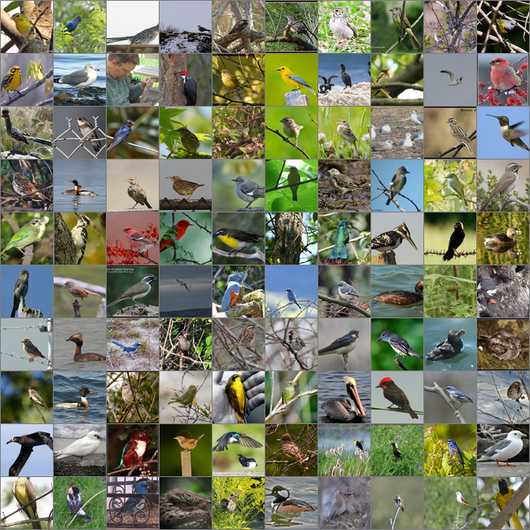

# Training Deep Recurrent Attention Writer (DRAW) on Bird Photos

Test Images:



The manifold after 1000 epochs


## Dependencies

1. [tensorflow 1.4.1](https://www.tensorflow.org/install/)
1. [cadl](https://github.com/pkmital/pycadl)

## Dataset

Six thousand bird photos from the [Caltech-UCSD Birds 200](http://www.vision.caltech.edu/visipedia/CUB-200.html) dataset

## Pre-processing Dataset

### Resize Images to 64 pixels square
```
mogrify -resize "64x64^" -gravity center -crop 64x64+0+0 *.jpg
```
### Strip exif data
```
mogrify -strip *.jpg
```
### Convert any Grayscale Images to RGB
```
mogrify -type TrueColor *.jpg
```
## Training

### Hyperparameters
The default batch size of 100 worked well for a 2GB GPU.

Execute

```
python draw_birds.py
```

## Monitor Training

Execute to view loss chart and image reconstructions:

```
tensorboard --logdir=.
```

## Author
- Author: [@pkmital](https://github.com/pkmital)
- Contributor: [@hollygrimm](https://github.com/hollygrimm)


## Further Reading

[DRAW: A Recurrent Neural Network For Image Generation](https://arxiv.org/abs/1502.04623)


